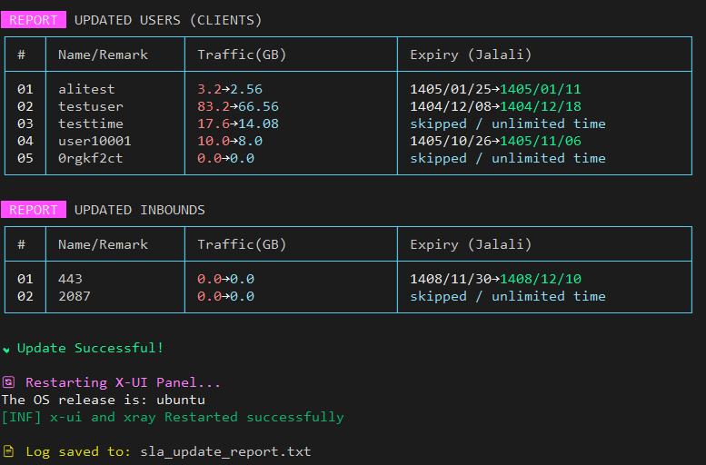

# 🚀 X-UI SLA Manager (مدیریت پیشرفته کاربران)

**ابزاری قدرتمند، امن و سریع برای مدیریت گروهی کاربران در پنل‌های X-UI**



## 📖 معرفی
مدیریت تعداد زیادی کاربر در پنل‌های X-UI می‌تواند خسته‌کننده باشد. فرض کنید سرور شما ۲ روز قطع بوده و می‌خواهید به عنوان جبران خسارت، به **همه کاربران** ۳ روز زمان اضافه کنید، یا می‌خواهید به کاربران **VIP** خود ۱۰ گیگابایت حجم هدیه بدهید. انجام این کار به صورت دستی برای صدها کاربر غیرممکن است.

ابزار **X-UI SLA Manager** این مشکل را حل کرده است. این اسکریپت با استفاده از **Python** و تعامل مستقیم با دیتابیس **SQLite**، به شما اجازه می‌دهد در چند ثانیه قوانین جدید (SLA) را روی کاربران خود اعمال کنید.

---

## ✨ ویژگی‌های کلیدی

- **🔍 فیلترینگ هوشمند و دقیق:**
  - امکان اعمال تغییرات روی **تمام کاربران**.
  - امکان جستجو و فیلتر کردن کاربران بر اساس **بخشی از نام یا ایمیل** (مثلاً فقط کاربرانی که `Guest` در نامشان دارند).

- **🧮 محاسبات ریاضی منعطف (درصد و مقدار ثابت):**
  - **افزایش/کاهش حجمی:** (مثال: اضافه کردن ۵ گیگابایت یا کسر ۲ گیگابایت).
  - **افزایش/کاهش زمانی:** (مثال: تمدید اشتراک به مدت ۱ هفته یا کسر ۳ روز).
  - **تغییرات درصدی:** (مثال: افزایش ۲۰٪ به حجم فعلی کاربران یا کسر ۱۰٪ از زمان باقی‌مانده).

- **📅 تقویم شمسی (Jalali):**
  - نمایش تاریخ انقضای کاربران به صورت **شمسی** در گزارش نهایی برای راحتی مدیران ایرانی.

- **🛡️ هسته امن و پایدار:**
  - استفاده از کتابخانه‌های داخلی پایتون (بدون نیاز به نصب پکیج‌های اضافی).
  - جلوگیری از خرابی دیتابیس با استفاده از تراکنش‌های امن SQL.

- **🎨 رابط کاربری زیبا:**
  - محیط ترمینال رنگی با طراحی سایبرپانک و لوگوی اختصاصی "World OF 01".
  - نمایش جدول گزارش تغییرات (قبل و بعد) برای اطمینان از صحت عملیات.

---

## 📥 نصب و اجرا (Installation)

برای استفاده از این ابزار نیاز به هیچ پیش‌نیاز پیچیده‌ای ندارید. فقط کافیست دستور زیر را در ترمینال سرور خود اجرا کنید:

```bash
bash <(curl -Ls [https://raw.githubusercontent.com/worldof01/x-ui/main/sla-manage/xuislatool.sh](https://raw.githubusercontent.com/worldof01/x-ui/main/sla-manage/xuislatool.sh))
