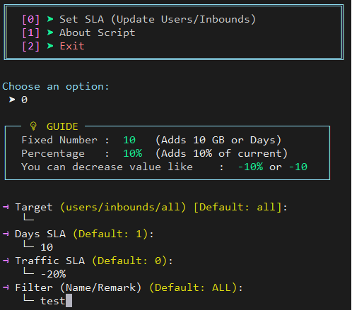

# 🚀 X-UI SLA Manager (مدیریت پیشرفته کاربران)

**ابزاری قدرتمند، امن و سریع برای مدیریت گروهی کاربران در پنل‌های X-UI**


---

## 📖 معرفی

مدیریت تعداد زیادی کاربر در پنل‌های X-UI می‌تواند خسته‌کننده باشد. ابزار **X-UI SLA Manager** با استفاده از **Python** و تعامل مستقیم با دیتابیس **SQLite**، به شما اجازه می‌دهد در چند ثانیه قوانین جدید (SLA) را روی کاربران خود اعمال کنید.

---

## ✨ ویژگی‌های کلیدی

* **🔍 فیلترینگ هوشمند:** اعمال تغییرات روی **همه** یا **کاربران خاص** (جستجو بر اساس نام/ایمیل).
* **🧮 محاسبات منعطف:** تغییرات به صورت **درصدی (٪)** یا **عدد ثابت**.
* **📅 تقویم شمسی:** نمایش تاریخ انقضا به صورت **شمسی (Jalali)**.
* **🛡️ امنیت بالا:** جلوگیری از خرابی دیتابیس با تراکنش‌های امن.
* **🎨 رابط کاربری زیبا:** محیط سایبرپانک با لوگوی اختصاصی.

---

## 📥 نصب و اجرا (Installation)

برای استفاده، کافیست دستور زیر را در ترمینال سرور خود اجرا کنید:

```bash
bash <(curl -Ls https://raw.githubusercontent.com/worldof01/x-ui/main/sla-manage/xuislatool.sh)
```

---

## 💡 راهنمای تصویری (مثال کاربردی)



در تصویر بالا یک نمونه واقعی از قدرت این ابزار را مشاهده می‌کنید.

### 🧪 سناریو نمونه

فرض کنید می‌خواهیم برای کاربرانی که **ایمیل آن‌ها شامل کلمه `test` است**، تغییرات زیر را اعمال کنیم:

* ➕ **۱۰ روز** به زمان انقضای آن‌ها اضافه کنیم (تشویقی)
* ➖ **۲۰٪** از حجم ترافیک آن‌ها را کم کنیم (جریمه یا اصلاح)

### ⚙️ نحوه تنظیم ورودی‌ها

* **Days SLA:** مقدار `10` وارد شده است → ۱۰ روز به تاریخ انقضا اضافه می‌شود
* **Traffic SLA:** مقدار `-20%` وارد شده است → ۲۰ درصد از حجم کاربر کم می‌شود
* **User Filter:** مقدار `test` وارد شده است → فقط کاربرانی که این کلمه در ایمیلشان باشد، تحت تأثیر قرار می‌گیرند

> 💡 نکته: اگر فیلتر کاربر را خالی بگذارید، تغییرات روی **تمام کاربران** اعمال خواهد شد.

---

## 📊 جدول راهنمای دستورات ورودی

پس از اجرای برنامه و انتخاب **گزینه 1**، می‌توانید از الگوهای زیر برای وارد کردن مقادیر استفاده کنید:

| نوع عملیات   | ورودی نمونه | توضیح عملکرد                         |
| ------------ | ----------- | ------------------------------------ |
| افزایش ثابت  | `10`        | اضافه کردن ۱۰ واحد (روز یا گیگابایت) |
| کاهش ثابت    | `-5`        | کسر کردن ۵ واحد (روز یا گیگابایت)    |
| افزایش درصدی | `20%`       | افزودن ۲۰٪ به مقدار فعلی کاربر       |
| کاهش درصدی   | `-10%`      | کسر ۱۰٪ از مقدار فعلی کاربر          |
| بدون تغییر   | *(خالی)*    | مقدار فعلی دست‌نخورده باقی می‌ماند   |

---

## ☕ حمایت (Donate)

توسعه و نگهداری ابزارهای رایگان نیازمند زمان و انرژی است. اگر این اسکریپت در مدیریت سرور به شما کمک کرد، خوشحال می‌شوم با یک قهوه حمایتم کنید ☺️

**TON Wallet (The Open Network):**

```
UQAykVgirxEyv8cgHAgpPGXwzUYFwviRZWS1QMGwx3KDHrsV
```

---

⭐ اگر این پروژه برایتان مفید بود، با یک **Star** در گیت‌هاب از آن حمایت کنید!
