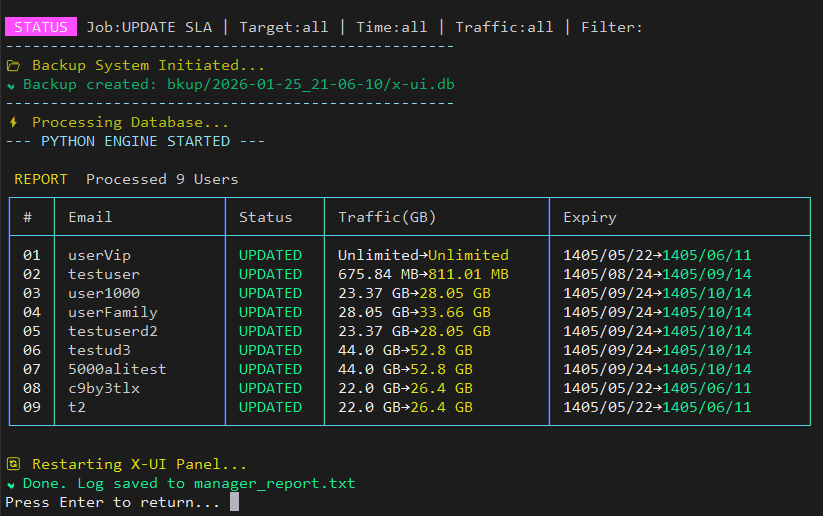

# 🚀 X-UI Manager (ابزار جامع مدیریت پنل X-UI)

**ابزاری قدرتمند، امن و سریع برای مدیریت هوشمند کاربران و SLA در پنل X-UI با قابلیت‌های پیشرفته فیلترینگ و ویرایش**



---

## 📖 معرفی پروژه

مدیریت کاربران، تاریخ انقضا و حجم ترافیک برای تعداد زیادی کاربر در پنل X-UI می‌تواند فرآیندی خسته‌کننده، زمان‌بر و پرخطا باشد. ابزار **X-UI Manager** با استفاده از ترکیب **Bash** و **Python** و اتصال مستقیم به دیتابیس **SQLite**، این فرآیندها را به‌شکلی **سریع، دقیق و ایمن** انجام می‌دهد.

این ابزار یک رابط کاربری منویی زیبا و کاربرپسند ارائه می‌دهد که امکان انجام عملیات‌های مختلف روی کاربران و Inboundها را فقط با چند کلیک ساده فراهم می‌کند. با استفاده از این ابزار می‌توانید تنظیمات SLA را برای کاربران و Inboundها مدیریت کنید، کاربران را بر اساس معیارهای مختلف فیلتر و در صورت نیاز حذف کنید، و گزارش کاملی از تغییرات اعمال شده دریافت نمایید.

---

## ✨ ویژگی‌های کلیدی

### 🎯 مدیریت جامع عملیات‌ها

ابزار X-UI Manager دو عملیات اصلی را پشتیبانی می‌کند که نیازهای مختلف مدیران سرور را پوشش می‌دهد. عملیات اول **تنظیم SLA** است که امکان تغییر تاریخ انقضا و حجم ترافیک کاربران را به‌صورت دسته‌ای فراهم می‌کند. عملیات دوم **حذف کاربران** است که به شما اجازه می‌دهد کاربرانی که دیگر نیاز ندارید را به‌سرعت و به‌صورت گروهی از سیستم حذف کنید. این قابلیت‌ها در کنار سیستم فیلترینگ پیشرفته، انعطاف‌پذیری بسیار بالایی برای مدیریت سرور فراهم می‌کنند.

### 🔍 سیستم فیلترینگ هوشمند

یکی از مهم‌ترین ویژگی‌های این ابزار، سیستم فیلترینگ چندگانه آن است که به شما اجازه می‌دهد دقیقاً کاربران مورد نظر خود را انتخاب و روی آن‌ها عملیات انجام دهید. این سیستم شامل چهار نوع فیلتر مختلف است که می‌توان آن‌ها را به‌صورت ترکیبی استفاده کرد. فیلتر **هدف** مشخص می‌کند که عملیات روی کاربران، Inboundها یا هر دو اعمال شود. فیلتر **زمان** امکان انتخاب کاربران فعال، منقضی شده یا همه کاربران را فراهم می‌کند. فیلتر **ترافیک** کاربران را بر اساس وضعیت مصرف حجم ترافیک فیلتر می‌کند. و در نهایت فیلتر **نام** بر اساس ایمیل کاربر یا Remark عمل می‌کند.

### 🧮 محاسبات منعطف برای SLA

سیستم محاسبات SLA در این ابزار بسیار منعطف و کاربرپسند طراحی شده است. برای تغییر حجم ترافیک می‌توانید از مقادیر عددی ثابت مانند «۱۰» برای افزودن ۱۰ گیگابایت یا «-۵» برای کاهش ۵ گیگابایت استفاده کنید. همچنین می‌توانید از درصد استفاده کنید؛ مثلاً «۲۵٪» برای افزایش ۲۵ درصدی یا «-۲۰٪» برای کاهش ۲۰ درصدی حجم ترافیک. برای تاریخ انقضا نیز همین قابلیت‌ها وجود دارد؛ می‌توانید روزها را به‌صورت عددی («۱۰» برای افزودن ۱۰ روز) یا درصدی («۱۰٪» برای افزایش ۱۰ درصدی زمان باقی‌مانده) تغییر دهید.

### 🛡️ امنیت و پشتیبان‌گیری خودکار

امنیت داده‌ها در این ابزار در اولویت قرار دارد. قبل از هرگونه تغییر در دیتابیس، به‌صورت خودکار از فایل دیتابیس اصلی پشتیبان‌گیری می‌شود. این پشتیبان‌ها در پوشه‌ای با نام timestamp ذخیره می‌شوند تا در صورت بروز هرگونه مشکل، بتوانید به‌راحتی داده‌های قبلی را بازیابی کنید. همچنین پس از اعمال موفق تغییرات، سرویس X-UI به‌صورت خودکار ریستارت می‌شود تا تغییرات فوراً اعمال شوند.

### 📊 گزارش‌دهی کامل و شفاف

پس از هر عملیات، گزارش کاملی از تغییرات اعمال شده نمایش داده می‌شود. این گزارش شامل جدولی است که تغییرات هر کاربر را به‌صورت مجزا نشان می‌دهد: نام کاربر، وضعیت عملیات (به‌روزرسانی یا حذف)، حجم ترافیک قبل و بعد از تغییر، و تاریخ انقضا قبل و بعد از تغییر. تاریخ‌ها به‌صورت شمسی (Jalali) نمایش داده می‌شوند تا برای کاربران فارسی‌زبان قابل فهم باشند. علاوه بر این، گزارش در فایلی متنی نیز ذخیره می‌شود تا در صورت نیاز بتوانید بعداً آن را بررسی کنید.

### 🎨 رابط کاربری زیبا و مدرن

این ابزار دارای یک رابط ترمینالی با طراحی سایبرپانک است که تجربه کاربری لذت‌بخشی را ارائه می‌دهد. لوگوی اختصاصی با کاراکترهای ASCII، منوهای رنگی با قابلیت انتخاب آسان، و نمایش گرافیکی وضعیت عملیات‌ها از ویژگی‌های ظاهری این ابزار هستند. طراحی منوها به‌گونه‌ای است که حتی کاربران مبتدی نیز می‌توانند به‌راحتی از آن استفاده کنند.

---

## 📥 نصب و اجرا

برای نصب و اجرای ابزار، کافیست دستور زیر را در ترمینال سرور خود وارد کنید. این دستور اسکریپت را از مخزن GitHub دانلود و به‌صورت مستقیم اجرا می‌کند:

```bash
bash <(curl -Ls https://github.com/worldof01/x-ui/blob/main/xui-manager/xuimanager.sh)
```

پس از اجرای دستور، منوی اصلی برنامه نمایش داده می‌شود و می‌توانید عملیات مورد نظر خود را انتخاب کنید. برای خروج از برنامه در هر مرحله می‌توانید از کلیدهای `Ctrl+C` استفاده کنید.

---

## 🎮 راهنمای استفاده از منو

### منوی اصلی (Main Menu)

پس از اجرای برنامه، با صفحه‌ای مشابه تصویر زیر مواجه می‌شوید که شامل سه گزینه اصلی است:

```
╔════════════════════════════════════════════════════╗
║  [0] ➤ User Management (SLA / Delete)              ║
║  [1] ➤ About Script                                ║
║  [2] ➤ Exit                                        ║
╚════════════════════════════════════════════════════╝
```

گزینه **User Management** برای ورود به بخش مدیریت کاربران و انجام عملیات‌های SLA یا حذف کاربران استفاده می‌شود. گزینه **About Script** اطلاعاتی درباره پروژه و روش‌های حمایت نمایش می‌دهد. و گزینه **Exit** برای خروج از برنامه کاربرد دارد.

### راهنمای گام‌به‌گام عملیات

پس از انتخاب گزینه User Management، باید چند مرحله را طی کنید تا عملیات مورد نظر شما انجام شود. در هر مرحله، راهنمای ساده‌ای در بالای صفحه نمایش داده می‌شود که به شما کمک می‌کند انتخاب صحیح داشته باشید.

---

## 📋 راهنمای جامع گزینه‌ها

### ۱. انتخاب عملیات (Job Selection)

در اولین مرحله، باید نوع عملیات مورد نظر خود را انتخاب کنید:

```
➜ Select Job [Default: 1]:
   [1] Set SLA (Update Traffic/Expiry)
   [2] Delete Selected (Remove Matching Users)
```

گزینه **Set SLA** برای تغییر تاریخ انقضا و حجم ترافیک کاربران استفاده می‌شود. این گزینه به شما اجازه می‌دهد مقادیر جدید را وارد کنید که می‌توانند به‌صورت عددی یا درصدی باشند. گزینه **Delete Selected** برای حذف کاربرانی است که با فیلترهای انتخابی شما مطابقت دارند. دقت کنید که عملیات حذف غیرقابل بازگشت است، بنابراین قبل از تأیید، فیلترها را با دقت بررسی کنید.

### ۲. انتخاب هدف (Target Selection)

در این مرحله مشخص می‌کنید که عملیات روی کدام بخش‌ها اعمال شود:

```
➜ Select Target [Default: 1]:
   [1] All (Users & Inbounds)
   [2] Users (Clients only)
   [3] Inbounds (Ports only)
```

گزینه **All** عملیات را روی تمام کاربران (Clients) و تمام Inboundها اعمال می‌کند. گزینه **Users** فقط روی کاربران (کلاینت‌های داخل Inboundها) عملیات انجام می‌دهد. گزینه **Inbounds** فقط روی Inboundها (پورت‌ها) عملیات انجام می‌دهد و کاربران را تغییر نمی‌دهد.

### ۳. تنظیمات SLA (فقط برای عملیات Set SLA)

اگر گزینه Set SLA را انتخاب کرده باشید، باید مقادیر جدید برای تاریخ انقضا و حجم ترافیک را وارد کنید:

```
┌── SLA VALUES ──────────────────────────────────────┐
│ Fixed: 10 (Add) | Percent: 10% | Reduce: -10       │
└────────────────────────────────────────────────────┘

➜ Days SLA (Default: 0):
➜ Traffic SLA (Default: 0):
```

برای **Days SLA** می‌توانید مقادیر زیر را وارد کنید: یک عدد مثبت مانند «۱۰» برای افزودن ۱۰ روز به تاریخ انقضا، یک عدد منفی مانند «-۵» برای کاهش ۵ روز از تاریخ انقضا، یا یک درصد مانند «۲۰٪» برای افزایش ۲۰ درصدی زمان باقی‌مانده. اگر فیلد را خالی بگذارید، مقدار پیش‌فرض «۰» در نظر گرفته می‌شود و تغییری در تاریخ انقضا ایجاد نمی‌شود. برای **Traffic SLA** نیز همین قوانین صدق می‌کند، با این تفاوت که مقادیر عددی بر اساس گیگابایت محاسبه می‌شوند. مثلاً «۱۰» یعنی افزودن ۱۰ گیگابایت به حجم ترافیک.

### ۴. فیلتر زمان (Time Filter)

این فیلتر به شما اجازه می‌دهد کاربران را بر اساس وضعیت تاریخ انقضای آن‌ها انتخاب کنید:

```
➜ Time Filter [Default: 1]:
   [1] All (Ignore Expiry Date)
   [2] Active (Not Expired)
   [3] Expired (Date Passed)
```

گزینه **All** همه کاربران را بدون توجه به تاریخ انقضا انتخاب می‌کند. گزینه **Active** فقط کاربرانی را انتخاب می‌کند که تاریخ انقضای آن‌ها نگذشته باشد و همچنان فعال هستند. گزینه **Expired** فقط کاربرانی را انتخاب می‌کند که تاریخ انقضای آن‌ها گذشته و منقضی شده‌اند.

### ۵. فیلتر ترافیک (Traffic Filter)

این فیلتر کاربران را بر اساس میزان مصرف حجم ترافیک انتخاب می‌کند:

```
➜ Traffic Filter [Default: 1]:
   [1] All (Ignore Traffic Usage)
   [2] Finished (Volume Exhausted)
   [3] Not Finished (Volume Remaining)
```

گزینه **All** همه کاربران را بدون توجه به میزان مصرف ترافیک انتخاب می‌کند. گزینه **Finished** فقط کاربرانی را انتخاب می‌کند که حجم ترافیک آن‌ها به پایان رسیده یا بیشتر از حد مجاز مصرف کرده‌اند. گزینه **Not Finished** فقط کاربرانی را انتخاب می‌کند که هنوز حجم ترافیک باقی‌مانده دارند.

### ۶. فیلتر نام (Name Filter)

در این مرحله می‌توانید کاربران را بر اساس نام یا ایمیل آن‌ها فیلتر کنید:

```
➜ Name Filter (Remark/Email) (Default: ALL):
```

اگر این فیلد را خالی بگذارید، عملیات روی تمام کاربران اعمال می‌شود. اما اگر بخواهید عملیات را محدود به کاربران خاصی کنید، می‌توانید بخشی از نام یا ایمیل آن‌ها را وارد کنید. مثلاً اگر «test» را وارد کنید، فقط کاربرانی که نام یا ایمیل آن‌ها شامل کلمه «test» است انتخاب می‌شوند. این قابلیت برای مدیریت کاربران VIP، ریسیلرها یا گروه‌های خاص بسیار مفید است.

---

## 💡 سناریوهای کاربردی

### سناریو ۱: تمدید اشتراک کاربران فعال

**هدف**: افزودن ۳۰ روز به تاریخ انقضا و ۵۰ گیگابایت حجم ترافیک برای تمام کاربران فعال (منقضی نشده) که هنوز حجم ترافیک دارند.

**تنظیمات ورودی**:

| گزینه | مقدار |
|-------|-------|
| Job | ۱ (Set SLA) |
| Target | ۱ (All) |
| Days SLA | ۳۰ |
| Traffic SLA | ۵۰ |
| Time Filter | ۲ (Active) |
| Traffic Filter | ۳ (Not Finished) |
| Name Filter | خالی (همه) |

**نتیجه**: تمام کاربران فعال که حجم ترافیک باقی‌مانده دارند، ۳۰ روز تمدید می‌شوند و ۵۰ گیگابایت به حجم ترافیک آن‌ها اضافه می‌شود.

### سناریو ۲: افزایش ۲۵ درصدی حجم ترافیک کاربران خاص

**هدف**: افزایش ۲۵ درصدی حجم ترافیک کاربرانی که نام آن‌ها شامل «vip» است.

**تنظیمات ورودی**:

| گزینه | مقدار |
|-------|-------|
| Job | ۱ (Set SLA) |
| Target | ۲ (Users) |
| Days SLA | ۰ |
| Traffic SLA | ۲۵٪ |
| Time Filter | ۱ (All) |
| Traffic Filter | ۱ (All) |
| Name Filter | vip |

**نتیجه**: حجم ترافیک تمام کاربرانی که نام آن‌ها شامل «vip» است، ۲۵ درصد افزایش می‌یابد.

### سناریو ۳: حذف کاربران منقضی شده

**هدف**: حذف تمام کاربرانی که تاریخ انقضای آن‌ها گذشته و دیگر نیازی به آن‌ها نیست.

**تنظیمات ورودی**:

| گزینه | مقدار |
|-------|-------|
| Job | ۲ (Delete Selected) |
| Target | ۲ (Users) |
| Time Filter | ۳ (Expired) |
| Traffic Filter | ۱ (All) |
| Name Filter | خالی (همه) |

**هشدار**: قبل از تأیید، مطمئن شوید که فیلترها صحیح هستند، زیرا عملیات حذف غیرقابل بازگشت است.

**نتیجه**: تمام کاربران منقضی شده از سیستم حذف می‌شوند.

### سناریو ۴: کاهش حجم ترافیک کاربران پرمصرف

**هدف**: کاهش ۱۰ درصدی حجم ترافیک کاربرانی که حجم ترافیک آن‌ها تمام شده است.

**تنظیمات ورودی**:

| گزینه | مقدار |
|-------|-------|
| Job | ۱ (Set SLA) |
| Target | ۲ (Users) |
| Days SLA | ۰ |
| Traffic SLA | -۱۰٪ |
| Time Filter | ۱ (All) |
| Traffic Filter | ۲ (Finished) |
| Name Filter | خالی (همه) |

**نتیجه**: حجم ترافیک تمام کاربرانی که ترافیک آن‌ها تمام شده، ۱۰ درصد کاهش می‌یابد.

---

## 🛡️ بکاپ و بازیابی

### مسیر پشتیبان‌ها

قبل از هر تغییر، به‌صورت خودکار از دیتابیس پشتیبان‌گیری می‌شود. این پشتیبان‌ها در مسیر زیر ذخیره می‌شوند:

```
bkup/YYYY-MM-DD_HH-MM-SS/x-ui.db
```

برای بازیابی یک پشتیبان، کافیست فایل پشتیبان را به مسیر اصلی دیتابیس کپی کنید:

```bash
cp bkup/2026-01-25_10-30-00/x-ui.db /etc/x-ui/x-ui.db
```

سپس سرویس X-UI را ریستارت کنید:

```bash
x-ui restart
```

### نکات مهم امنیتی

همیشه قبل از اجرای عملیات‌های مهم، بهتر است به‌صورت دستی نیز از دیتابیس پشتیبان‌گیری کنید. برای این کار می‌توانید از دستور زیر استفاده کنید:

```bash
cp /etc/x-ui/x-ui.db /path/to/backup/x-ui-backup-$(date +%Y%m%d).db
```

---

## 📑 گزارش خروجی

### نمونه گزارش عملیات موفق

پس از اتمام عملیات، جدولی مشابه زیر نمایش داده می‌شود:

```
 REPORT Processed 5 Users
┌────┬──────────────────┬─────────┬────────────────────────┬────────────────────────┐
│ #  │ Email            │ Status  │ Traffic(GB)            │ Expiry                 │
├────┼──────────────────┼─────────┼────────────────────────┼────────────────────────┤
│ 01 │ user1@test.com   │ UPDATED │ 100→120                │ 1403/04/15→1403/05/15  │
│ 02 │ user2@test.com   │ UPDATED │ 50→60                  │ 1403/04/20→1403/05/20  │
│ 03 │ vip@domain.com   │ UPDATED │ Unlimited→Unlimited    │ 1403/04/10→1403/05/10  │
│ 04 │ test@site.com    │ DELETED │ 0                      │ 1402/12/01              │
│ 05 │ user5@test.com   │ UPDATED │ 200→200                │ Unlimited→Unlimited    │
└────┴──────────────────┴─────────┴────────────────────────┴────────────────────────┘
```

### ذخیره گزارش

گزارش عملیات در فایلی با نام `manager_report.txt` در پوشه جاری ذخیره می‌شود. این فایل شامل اطلاعات ساده‌تری است که برای بررسی‌های بعدی مفید است:

```
--- REPORT 2026-01-25 10:30:00 ---
user1@test.com | UPDATED | 100->120
user2@test.com | UPDATED | 50->60
test@site.com | DELETED | 0->0
```

---

## 🐛 حالت Debug

اگر با مشکلی مواجه شدید یا نیاز به اطلاعات بیشتر برای عیب‌یابی دارید، می‌توانید حالت Debug را فعال کنید. برای این کار، فایل اسکریپت را ویرایش کرده و مقدار `DEBUG_MODE` را از `"false"` به `"true"` تغییر دهید:

```bash
DEBUG_MODE="true"
```

در حالت Debug، اطلاعات تفصیلی‌تری درباره فرآیندهای داخلی برنامه نمایش داده می‌شود که می‌تواند برای شناسایی مشکلات مفید باشد.

---

## 🔧 نصب و اجرای محلی (اختیاری)

اگر می‌خواهید اسکریپت را روی سیستم خودتان دانلود و اجرا کنید، می‌توانید از روش زیر استفاده کنید:

```bash
# دانلود اسکریپت
curl -O https://raw.githubusercontent.com/worldof01/x-ui/main/sla-manage/xuislatool.sh

# اجرای اسکریپت
bash xuislatool.sh
```

---

## 📋 نکات مهم

### آیتم‌های Unlimited

کاربرانی که حجم ترافیک یا تاریخ انقضای آن‌ها به‌صورت «نامحدود» تنظیم شده، معمولاً تحت تأثیر تغییرات قرار نمی‌گیرند. این رفتار برای جلوگیری از تغییر ناخواسته حساب‌های ویژه طراحی شده است.

### مجوزهای دسترسی

برای اجرای این اسکریپت، به دسترسی ریشه (Root) نیاز دارید، زیرا باید به فایل دیتابیس در مسیر `/etc/x-ui/` دسترسی داشته باشد و سرویس X-UI را ریستارت کند.

### سازگاری

این ابزار با تمام نسخه‌های X-UI که از دیتابیس SQLite استفاده می‌کنند سازگار است. نسخه‌های تست شده شامل X-UI نسخه ۰.۳.۲ و بالاتر می‌شوند.

---

## 💝 حمایت از پروژه

اگر این ابزار در مدیریت سرور و کاربران به شما کمک کرد، خوشحال می‌شوم با حمایت خود انگیزه توسعه و بهبود این پروژه را افزایش دهید. هرگونه کمک، چه به‌صورت گزارش مشکل، پیشنهاد ویژگی جدید، یا حمایت مالی، ارزشمند است.

**کیف پول TON (شبکه باز):**

```
UQAykVgirxEyv8cgHAgpPGXwzUYFwviRZWS1QMGwx3KDHrsV
```

---

## 📞 ارتباط و贡献

این پروژه در GitHub میزبانی می‌شود. می‌توانید برای گزارش مشکلات، پیشنهاد ویژگی‌های جدید، یا مشارکت در توسعه، از صفحه مخزن ما دیدن کنید. نظرات، پیشنهادات و انتقادات شما همیشه پذیرفته می‌شود و به بهتر شدن این ابزار کمک می‌کند.

**نویسنده**: worldof01

**مخزن GitHub**: https://github.com/worldof01

---

⭐ اگر این پروژه برایتان مفید بود، با ستاره دادن در GitHub از آن حمایت کنید و آن را با دیگران به اشتراک بگذارید.
